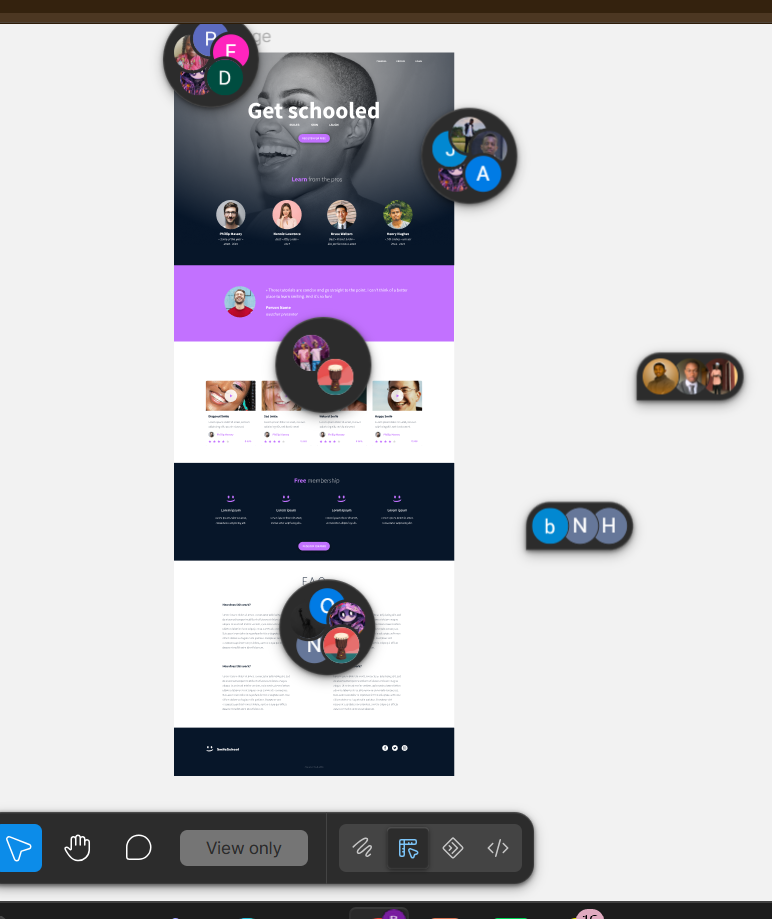

# HTML Advanced


## 📖 About the project

This project is the first step of a series where we rebuild a designer's
mockup from scratch, piece by piece. The final result — a fully styled
webpage — is designed in Figma, but for **this** project, the goal is to
focus exclusively on **semantic HTML structure**: no CSS, no styling, no
visual polish. Just clean, meaningful markup.

The idea is to translate a visual design into the right HTML tags based on
the *meaning* of each section — using `header`, `main`, `article`, `aside`,
`footer`, and other semantic elements where they truly belong, rather than
defaulting to generic `div`s everywhere.

## 🎯 Objectives

- Read and interpret a Figma design file
- Translate visual sections into semantically correct HTML5 tags
- Practice proper document structure: `header`, `nav`, `main`, `section`,
  `article`, `aside`, `footer`
- Build a solid foundation to apply CSS styling in later projects

## 🖼️ Design reference

The design for this project was created in Figma. You can view it here:

- [Figma page](https://intranet.aluswe.com/rltoken/AvebjcsZhQIMt3DsN_fiZA)
- [Figma file (.fig)](https://intranet.aluswe.com/rltoken/BOC4LSHhGgn-RudlXjuUKg)

> 💡 Duplicate the file to your own Drafts in Figma to inspect exact spacing,
> colors, and font sizes.

Below is a snapshot of the target design:



*(Screenshot exported from the Figma file above — replace with your own
export if needed.)*

## 🔤 Fonts

The design uses two custom fonts. If they're not already installed on your
machine, you can download them here:

- [Source Sans Pro](https://intranet.aluswe.com/rltoken/76O2REi_XN8esxhm9fZg9w)
- [Spin Cycle OT](https://intranet.aluswe.com/rltoken/tIZuYvssJ291nB0BWUl-Tw)

## 📝 Notes

- Some values in the Figma file are floating-point numbers (e.g. spacing,
  font sizes). Feel free to round them to the nearest sensible integer.
- No CSS is required at this stage — the HTML should simply follow a logical,
  semantic structure that mirrors the layout of the design.

## 📂 Repository structure

```
alu-web-development/
└── html_advanced/
    ├── README.md
    └── index.html
```

## 🛠️ How to view

Simply open `index.html` in your browser. Since no CSS is applied yet, the
page will look unstyled — that's expected at this stage.

## ✍️ Author

Project completed as part of the ALX Software Engineering program, Web
Dev# HTML Advanced


## 📖 About the project

This project is the first step of a series where we rebuild a designer's
mockup from scratch, piece by piece. The final result — a fully styled
webpage — is designed in Figma, but for **this** project, the goal is to
focus exclusively on **semantic HTML structure**: no CSS, no styling, no
visual polish. Just clean, meaningful markup.

The idea is to translate a visual design into the right HTML tags based on
the *meaning* of each section — using `header`, `main`, `article`, `aside`,
`footer`, and other semantic elements where they truly belong, rather than
defaulting to generic `div`s everywhere.

## 🎯 Objectives

- Read and interpret a Figma design file
- Translate visual sections into semantically correct HTML5 tags
- Practice proper document structure: `header`, `nav`, `main`, `section`,
  `article`, `aside`, `footer`
- Build a solid foundation to apply CSS styling in later projects

## 🖼️ Design reference

The design for this project was created in Figma. You can view it here:

- [Figma page](https://intranet.aluswe.com/rltoken/AvebjcsZhQIMt3DsN_fiZA)
- [Figma file (.fig)](https://intranet.aluswe.com/rltoken/BOC4LSHhGgn-RudlXjuUKg)

> 💡 Duplicate the file to your own Drafts in Figma to inspect exact spacing,
> colors, and font sizes.

Below is a snapshot of the target design:


*(Screenshot exported from the Figma file above — replace with your own
export if needed.)*

## 🔤 Fonts

The design uses two custom fonts. If they're not already installed on your
machine, you can download them here:

- [Source Sans Pro](https://intranet.aluswe.com/rltoken/76O2REi_XN8esxhm9fZg9w)
- [Spin Cycle OT](https://intranet.aluswe.com/rltoken/tIZuYvssJ291nB0BWUl-Tw)

## 📝 Notes

- Some values in the Figma file are floating-point numbers (e.g. spacing,
  font sizes). Feel free to round them to the nearest sensible integer.
- No CSS is required at this stage — the HTML should simply follow a logical,
  semantic structure that mirrors the layout of the design.

## 📂 Repository structure

```
alu-web-development/
└── html_advanced/
    ├── README.md
    └── index.html
```

## 🛠️ How to view

Simply open `index.html` in your browser. Since no CSS is applied yet, the
page will look unstyled — that's expected at this stage.

## ✍️ Author

Project completed as part of the ALX Software Engineering program, Web
Devel# HTML Advanced


## 📖 About the project

This project is the first step of a series where we rebuild a designer's
mockup from scratch, piece by piece. The final result — a fully styled
webpage — is designed in Figma, but for **this** project, the goal is to
focus exclusively on **semantic HTML structure**: no CSS, no styling, no
visual polish. Just clean, meaningful markup.

The idea is to translate a visual design into the right HTML tags based on
the *meaning* of each section — using `header`, `main`, `article`, `aside`,
`footer`, and other semantic elements where they truly belong, rather than
defaulting to generic `div`s everywhere.

## 🎯 Objectives

- Read and interpret a Figma design file
- Translate visual sections into semantically correct HTML5 tags
- Practice proper document structure: `header`, `nav`, `main`, `section`,
  `article`, `aside`, `footer`
- Build a solid foundation to apply CSS styling in later projects

## 🖼️ Design reference

The design for this project was created in Figma. You can view it here:

- [Figma page](https://intranet.aluswe.com/rltoken/AvebjcsZhQIMt3DsN_fiZA)
- [Figma file (.fig)](https://intranet.aluswe.com/rltoken/BOC4LSHhGgn-RudlXjuUKg)

> 💡 Duplicate the file to your own Drafts in Figma to inspect exact spacing,
> colors, and font sizes.

Below is a snapshot of the target design:


*(Screenshot exported from the Figma file above — replace with your own
export if needed.)*

## 🔤 Fonts

The design uses two custom fonts. If they're not already installed on your
machine, you can download them here:

- [Source Sans Pro](https://intranet.aluswe.com/rltoken/76O2REi_XN8esxhm9fZg9w)
- [Spin Cycle OT](https://intranet.aluswe.com/rltoken/tIZuYvssJ291nB0BWUl-Tw)

## 📝 Notes

- Some values in the Figma file are floating-point numbers (e.g. spacing,
  font sizes). Feel free to round them to the nearest sensible integer.
- No CSS is required at this stage — the HTML should simply follow a logical,
  semantic structure that mirrors the layout of the design.

## 📂 Repository structure

```
alu-web-development/
└── html_advanced/
    ├── README.md
    └── index.html
```

## 🛠️ How to view

Simply open `index.html` in your browser. Since no CSS is applied yet, the
page will look unstyled — that's expected at this stage.

## ✍️ Author

Project completed as part of the ALX Software Engineering program, Web
Development track.d


## 📖 About the project

This project is the first step of a series where we rebuild a designer's
mockup from scratch, piece by piece. The final result — a fully styled
webpage — is designed in Figma, but for **this** project, the goal is to
focus exclusively on **semantic HTML structure**: no CSS, no styling, no
visual polish. Just clean, meaningful markup.

The idea is to translate a visual design into the right HTML tags based on
the *meaning* of each section — using `header`, `main`, `article`, `aside`,
`footer`, and other semantic elements where they truly belong, rather than
defaulting to generic `div`s everywhere.

## 🎯 Objectives

- Read and interpret a Figma design file
- Translate visual sections into semantically correct HTML5 tags
- Practice proper document structure: `header`, `nav`, `main`, `section`,
  `article`, `aside`, `footer`
- Build a solid foundation to apply CSS styling in later projects

## 🖼️ Design reference

The design for this project was created in Figma. You can view it here:

- [Figma page](https://intranet.aluswe.com/rltoken/AvebjcsZhQIMt3DsN_fiZA)
- [Figma file (.fig)](https://intranet.aluswe.com/rltoken/BOC4LSHhGgn-RudlXjuUKg)

> 💡 Duplicate the file to your own Drafts in Figma to inspect exact spacing,
> colors, and font sizes.

Below is a snapshot of the target design:


*(Screenshot exported from the Figma file above — replace with your own
export if needed.)*

## 🔤 Fonts

The design uses two custom fonts. If they're not already installed on your
machine, you can download them here:

- [Source Sans Pro](https://intranet.aluswe.com/rltoken/76O2REi_XN8esxhm9fZg9w)
- [Spin Cycle OT](https://intranet.aluswe.com/rltoken/tIZuYvssJ291nB0BWUl-Tw)

## 📝 Notes

- Some values in the Figma file are floating-point numbers (e.g. spacing,
  font sizes). Feel free to round them to the nearest sensible integer.
- No CSS is required at this stage — the HTML should simply follow a logical,
  semantic structure that mirrors the layout of the design.

## 📂 Repository structure

```
alu-web-development/
└── html_advanced/
    ├── README.md
    └── index.html
```

## 🛠️ How to view

Simply open `index.html` in your browser. Since no CSS is applied yet, the
page will look unstyled — that's expected at this stage.

## ✍️ Author

Project completed as part of the ALX Software Engineering program, Web
Development track.
